
# Proyecto #1: Análisis de Algoritmos II
 
**Profesor:** Carlos Andrés Delgado S.  
**Fecha:** Mayo 7 2025  
**Estudiantes:**  
- Johan Acosta  - 2380393
- Juan Camilo Gutiérrez - 2159874 
- Andrés Felipe Rojas - 2160328

---

## 📘 Introducción

Este proyecto aborda la implementación y análisis de algoritmos aplicados a dos problemas clásicos, haciendo uso de estrategias de **programación dinámica**, **algoritmos voraces**, y **fuerza bruta**. El objetivo principal es comparar estas aproximaciones en términos de eficiencia, calidad de solución y escalabilidad, integrando además buenas prácticas de pruebas, medición de tiempos y documentación en un entorno controlado.

Los dos problemas planteados fueron:

1. **Subsecuencias más largas de un palíndromo**: encontrar las subsecuencias palindrómicas de máxima longitud ignorando diferencias de mayúsculas/minúsculas y caracteres no alfanuméricos.
2. **Planeando una fiesta de la compañía**: dada la jerarquía de empleados como un árbol, seleccionar invitados maximizando la suma de calificaciones de convivencia, sin invitar a empleados y sus supervisores directos al mismo tiempo.

Ambos problemas fueron resueltos utilizando múltiples estrategias, evaluando no solo su correctitud sino también su rendimiento computacional a través de pruebas sistemáticas.

---
##  Planeando una fiesta de la compañía

## 🎯 Descripción del problema

Dado un árbol que representa la jerarquía de empleados de una empresa y sus calificaciones de convivencia, el objetivo es maximizar la suma de dichas calificaciones al seleccionar un subconjunto de empleados para asistir a una fiesta. **Restricción:** ningún empleado puede asistir si su supervisor directo también lo hace.

---

## 🧠 Enfoques implementados

Se implementaron tres estrategias para resolver el problema:

- **Fuerza bruta** (exploración exhaustiva)
- **Voraz** (selección localmente óptima)
- **Programación dinámica sobre árboles**

---

## 🗂️ Estructura de carpetas

PROYECTO-1-ADA-II-2025-I-GRUPO-F/
- ├── .github/
- ├── docs/
- │ └── imagenes/
- ├── src/
- │ ├── fiesta/
- │ │ ├── dp_arbol.py
- │ │ ├── fuerza_bruta.py
- │ │ ├── medir_tiempo.py
- │ │ ├── resolver.py
- │ │ ├── utils.py
- │ │ └── voraz.py
- │ ├── fiesta.py
- │ └── subsecuencias.py
- ├── tests/
- │ └── test_fiesta.py
- │ └── test_subsecuencias.py
- ├── subsecuencias.txt
- ├── requirements_dev.txt
- ├── environment.yml
- ├── pyproject.toml
- ├── MANIFEST.in
- ├── Makefile
- └── README.md

---

## 📄 Descripción de los archivos

### `fiesta.py`
Archivo principal de entrada. Permite al usuario seleccionar un archivo `.txt` con los datos de entrada. Procesa todos los problemas y ejecuta los tres métodos, mostrando los resultados en consola.

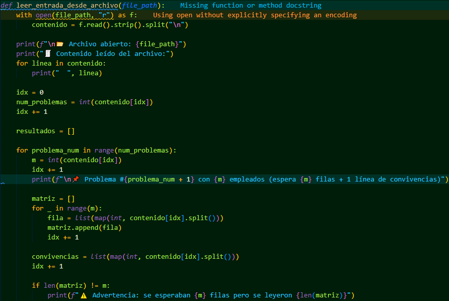
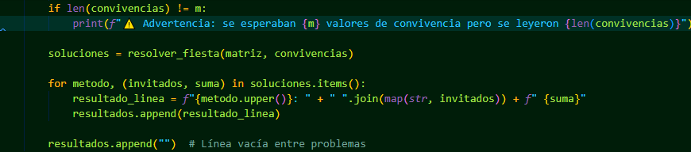

---

### `resolver.py`
Controlador principal que llama a cada una de las estrategias y mide su tiempo de ejecución.

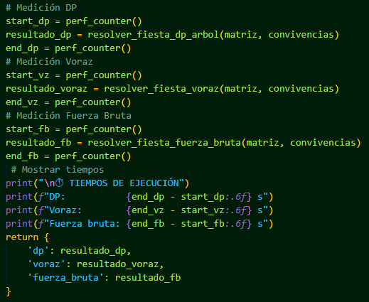

---

### `dp_arbol.py`
Implementación basada en **programación dinámica sobre árboles**. Usa recursividad y decisiones óptimas para cada nodo.

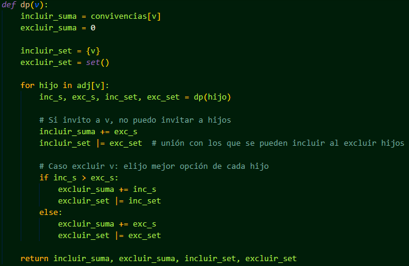
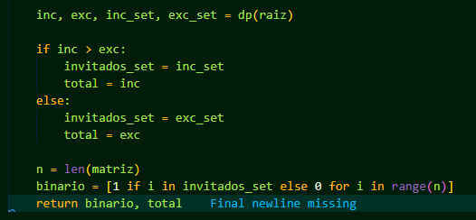

---

### `fuerza_bruta.py`
Explora todas las combinaciones posibles de empleados y selecciona la de mayor suma válida.

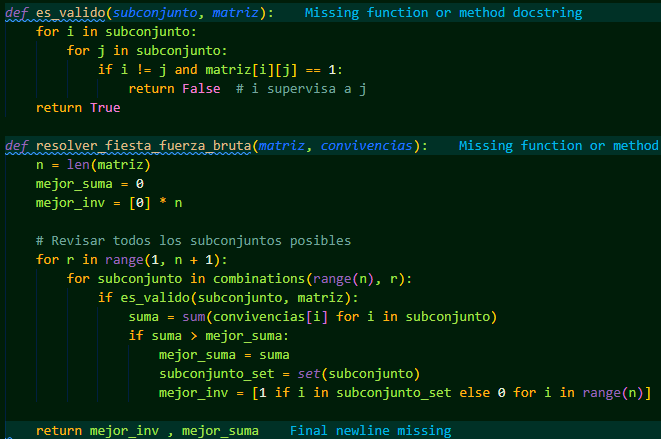

---

### `voraz.py`
Selecciona empleados por orden descendente de calificación, evitando conflictos con invitados anteriores.

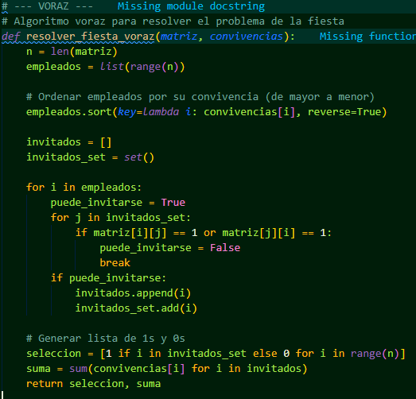

---

### `utils.py`
Contiene funciones auxiliares para:
- Convertir la matriz de adyacencia a lista
- Validar si la estructura es un árbol enraizado

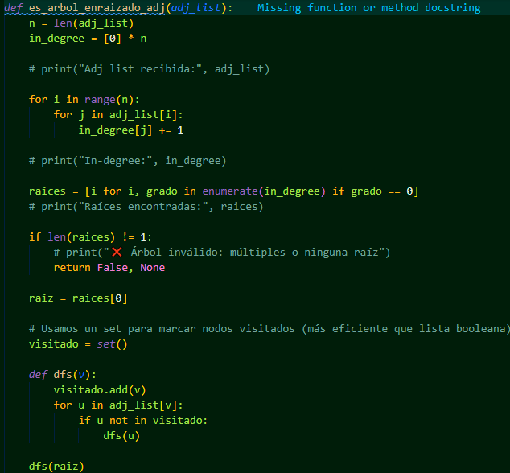
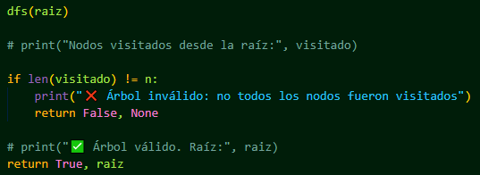

---

### `medir_tiempo.py`
Script para medir rendimiento de los métodos **DP** y **Voraz** con entradas generadas aleatoriamente. Genera gráficas comparando la complejidad teórica con los resultados experimentales.

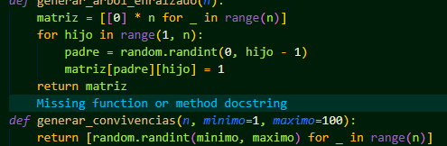

---

## ✅ Pruebas (Problema 2)

Se realizaron pruebas unitarias usando `unittest`, en el archivo `test_subsecuencias.py`. Las pruebas del problema 2 pueden integrarse siguiendo la misma lógica, validando que:

- Las soluciones generadas por cada método respetan la restricción jerárquica.
- La suma total corresponde a la de los empleados invitados.
- Se evalúan con diferentes tamaños (juguete, pequeño, etc.)

---

## 🧪 Tiempos de ejecución

Los tiempos fueron medidos con `time.perf_counter()` y promediados en 5 ejecuciones para los siguientes tamaños:

- 100, 500, 1000, 2000, 5000, 10000, 15000, 20000

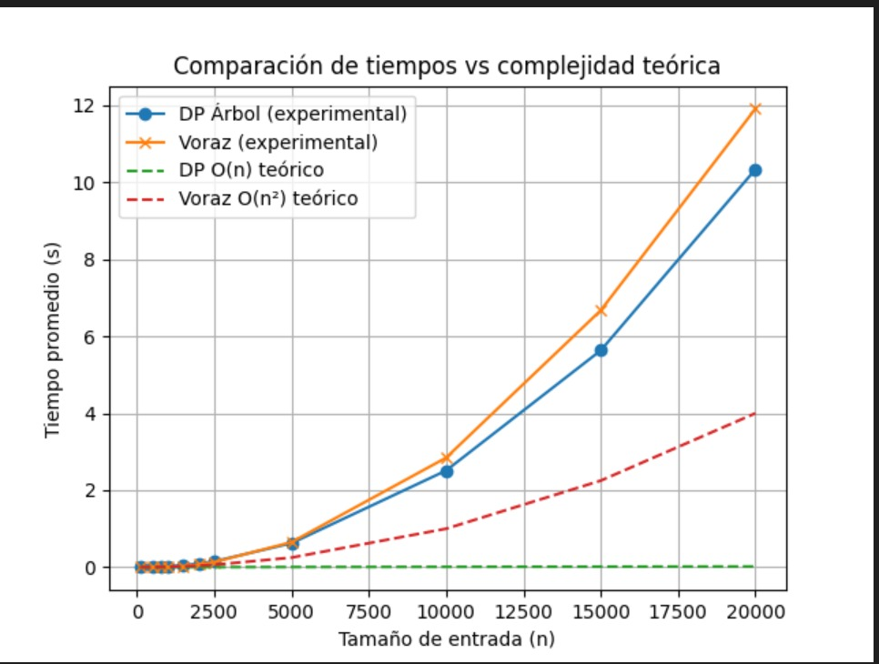

---

## 🛠️ Requisitos técnicos

- Estructura de proyecto modular
- Lectura de archivo con selector gráfico (`tkinter`)
- Pruebas con `unittest`
- Uso de Git y GitHub Actions para CI/CD
- Informe en Markdown

---

## 📈 Complejidad computacional estimada

| Método         | Complejidad estimada |
|----------------|----------------------|
| Fuerza bruta   | O(2ⁿ × n²)            |
| Voraz          | O(n²)                |
| DP en árbol    | O(n)                 |

---

## 📄 Problema 1: Subsecuencias más largas de un palíndromo

Se implementaron tres métodos para encontrar la subsecuencia palindrómica más larga en una cadena:

- **Fuerza bruta:** explora todas las posibles subsecuencias.
- **Programación dinámica:** utiliza subproblemas para construir la solución óptima.
- **Voraz (pseudo-voraz):** detecta palíndromos al expandir desde el centro (más eficiente en tiempo real, pero no siempre da la subsecuencia más larga si no es continua).

### `subsecuencias.py`

Este archivo contiene los tres métodos, más una función de normalización y lectura desde archivo usando `filedialog`.

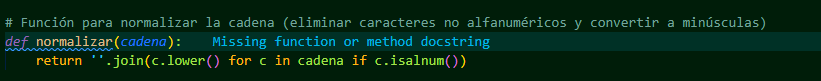
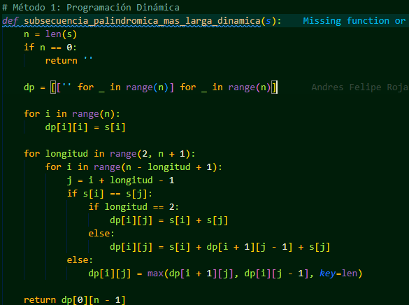
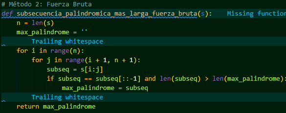
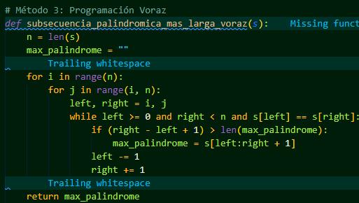
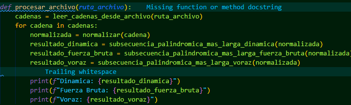

---

## ✅ Pruebas (Problema 1)

El archivo `test/test_subsecuencias.py` contiene pruebas automatizadas para verificar el rendimiento y la correctitud de los tres métodos. Las pruebas incluyen tamaños:

- **Juguete** (10)
- **Pequeño** (100)
- **Mediano** (1000)
- **Grande** (10000)
- *(Extra grande comentado por precaución)*

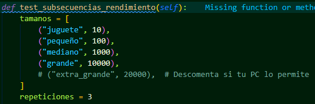

---

## 📈 Complejidad estimada (Problema 1)

| Método                         | Complejidad          |
|-------------------------------|----------------------|
| Fuerza bruta                  | O(n³)                |
| Programación dinámica         | O(n²)                |
| Búsqueda centro-expandida     | O(n²)                |

---

## 🧾 Conclusiones

- La programación dinámica es la más confiable para obtener la solución óptima, especialmente para cadenas largas.
- La estrategia voraz (center-expansion) es muy rápida, pero puede fallar si la subsecuencia palindrómica más larga no es continua.
- La fuerza bruta es solo viable en tamaños muy pequeños, útil como benchmark o para validación.

